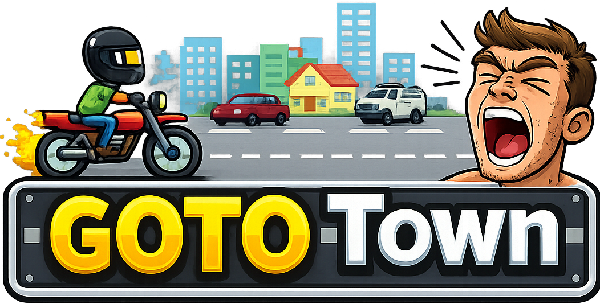
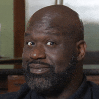
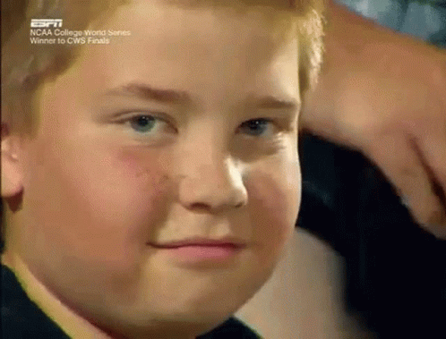
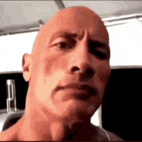
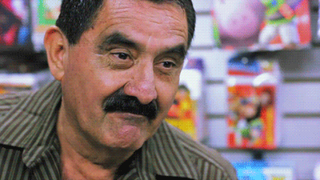
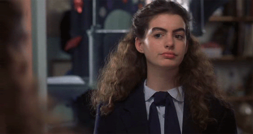
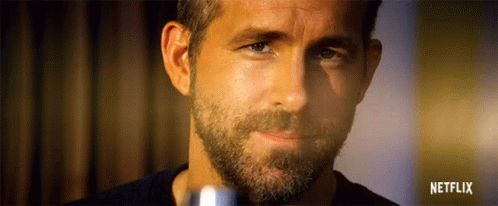

# GOTO TOWN ಠಿ_ಠ

A ridiculous web game controlled with your eyes, brows, and bawls



<div align="center">
    
    
    
    
    
    
    
    
    
</div>
<br>
<br>
One boy. One bike. One impossibly congested highway. Zero excuses for being late to Mr Smeed's 9 AM lecture on Low Level Programming." Made for [Jerbob's Silly Jam](https://leereilly.itch.io/goto-town).

---

## THE STORY SO FAR

Lee , age 19, woke up at 8:47 AM. His alarm? Dead. His phone? Dead. His will to live? Questionable.

But Lee has a DREAM. Not a big dream. Not a noble dream. The dream of arriving to his 9 AM university lecture *on time* for the first time this semester — because Mr Smeed said, and I quote, **"One more tardy and I'm failing you, Mr. Reilly."**

Unfortunately, Lee lives 14 miles outside of town. His car? Repossessed. His train pass? Expired. His dignity? Long gone.

All he has is a second-hand bike, a face full of emotions, and lungs that could wake the dead.

**GOTO Town** is the critically unacclaimed story of one young man's desperate commute through three increasingly hostile biomes of suburban hell — dodging ice cream vans driven by maniacs, plumbing vans that appear to have no concept of lanes, and a suspicious number of yellow school buses that are somehow ALL running late too.

Will Lee make it to his Low Level Programming lecture? Will Mr. Smeed show mercy? Will the guy in the brown Datsun PLEASE just pick a lane?

**Only your eyebrows can decide.**

---

## HOW TO PLAY

### 🎥 FACE CONTROLS *(Recommended — this is the INTENDED experience)*

GOTO Town was designed from the ground up to be played with your face. Yes. Your actual face. The one you're wearing right now.

| Action | How | Pro Tip |
|---|---|---|
| **Move UP a lane** | 🤨 Raise your eyebrows | Channel your inner "excuse me, did you just cut me off?" |
| **Move DOWN a lane** | 😑 Close both eyes or wink | The universal expression for "I've made a terrible life decision" |
| **HONK / Fire** | 🗣️ SCREAM into your microphone | Shout, yell, say "pew", blow raspberries — volume is all that matters. Pretend you're Lee, stuck behind an ice cream van doing 15 in a 60 zone |

#### Calibration

When you first launch the game, you'll be asked to calibrate your face. This is not optional. The game needs to learn your:
- **Neutral face** (your "I'm fine, everything is fine" expression)
- **Raised eyebrows** (your "WHAT is that Datsun doing" expression)
- **Wink thresholds** (so normal blinking doesn't send Lee careening into a bus)
- **Voice levels** (quiet → speaking → SCREAMING)

Calibration is saved locally. You won't need to redo it between runs unless your face changes significantly. Which it shouldn't. Hopefully.

### ⌨️ KEYBOARD CONTROLS *(For cowards and people in open-plan offices)*

| Key | Action |
|---|---|
| `W` / `↑` | Move up one lane |
| `S` / `↓` | Move down one lane |
| `SPACE` | Honk at vehicle ahead |
| `` ` `` (backtick) | Debug overlay |

Keyboard works immediately. No calibration. No judgement. Okay, a little judgement.

---

## THE WORLD OF GOTO TOWN

### 🌿 Stage 1: Green Outskirts
*"Ah, the suburbs. Birds singing. Trees swaying. A man in a pink jeep running a red light."*

Light traffic. Gentle introduction. Lee thinks, naively, that this won't be so bad. Lee is wrong.

### 🌅 Stage 2: Sunburn Highway
*"The open road. The warm breeze. The luton van doing 30 in the fast lane with its hazards on."*

Traffic thickens. Plumbing vans multiply. Oil slicks appear because of course they do. Lee begins to sweat. The lecture starts in 6 minutes.

### 🌃 Stage 3: Neon City Approach
*"You can see the university clock tower. You can see the car park. You can see the flatbed truck carrying an ENTIRE HOUSE blocking three lanes."*


---

## GAME MECHANICS

### ❤️ Health
Lee has 3 HP. Every collision costs one heart. At zero, Lee is late. Mr. Smeed is disappointed. Everyone is disappointed.

After taking a hit, Lee wobbles dramatically on his bike and gets brief invulnerability — because even the universe feels a bit sorry for him.

### 📢 Honking
Screaming at vehicles ahead of you in the same lane makes them swerve into an adjacent lane. They wobble in panic as they do so, which is extremely satisfying.

**Note:** Large vehicles (school buses, flatbed trucks) are IMMOVABLE. They do not care about your screams. They have heard it all before. They will flash red briefly, as if to say "lol no."

### ⏱️ Timer
A running clock tracks how long Lee has been cycling. This is also your score for the high score table. Survive longer = higher score.

### 🏆 High Scores
Top 5 times are saved locally. If you make the board, you can enter your name (8 characters max). Finally, recognition for screaming at your laptop.

---

## GETTING STARTED

```bash
npm install
npm run dev
```

Open the URL in **Chrome** (recommended) or Edge. Grant camera and microphone permissions when prompted. Position your face in front of the webcam. Try to look like someone who is NOT about to fail Comparative Frog Biology.

Press **ENTER** to begin calibration. Follow the on-screen prompts. Then press **ENTER** again to start Lee's desperate journey.

---

## REQUIREMENTS

- A modern browser (Chrome/Edge recommended)
- A webcam (for face controls)
- A microphone (for screaming)
- A complete lack of self-consciousness about making faces at your computer
- The ability to explain to your housemates why you keep shouting "PEW PEW PEW" at 9 AM

---

## FAQ

**Q: Can I play without a webcam/mic?**
A: Yes. Keyboard controls work fine. But you'll miss the core experience of frantically raising your eyebrows at a screen while shouting at a digital plumbing van.

**Q: My winks keep getting detected as blinks.**
A: Recalibrate. If the problem persists, try more exaggerated winks. Really commit to it. One eye OPEN, one eye CLOSED. Like a pirate. A pirate who is late for university.

**Q: The game keeps firing when I'm not shouting.**
A: You might be in a noisy environment. Recalibrate in a quieter room, or close the window. The literal window, not the browser window.

**Q: Did Lee ever pass Low Level Programming?**
A: Yes! And with flying colors, you C!

---

## Accessibility

If you're Mia Goth or another hawt Hollywood celeb with no eyebrows, please contact me for a private build 😉

---

## CREDITS

Built with [Phaser 3](https://phaser.io/), [MediaPipe Face Landmarker](https://developers.google.com/mediapipe), Web Audio API, TypeScript, and an unreasonable amount of eyebrow movement.

Vehicle sprites from [Kenney's Car Kit](https://kenney.nl/).

Music: ["Happy Chiptune"](https://pixabay.com/sound-effects/musical-happly-chiptune-122877/) from [Pixabay](https://pixabay.com/) ([Pixabay Content License](https://pixabay.com/service/license-summary/)).

Redonkolous coding by GitHub Copilot.

Silly idea by Lee Reilly.
